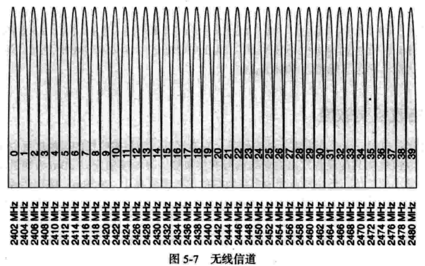

# BLE的基础知识




ble的信道和BR/EDR的信道是完全不一样的。但是范围是相同的，差不多也都是2.4Ghz的频道。可以简单理解为空中有40个信道0~39信道。两个设备在相同的信道里面可以进行相互通信。

而这些信道SIG又重新编号：


这个编号就是把37 38 39。 3个信道抽出来，作为广播信道，其他都是数据信道。这篇文章主要讲广播，所以基本数据信息都是围绕37 38 39这三个信道上面的通信来讲的。

我们可以看到这3个信道是分散排列的。大家可以思考下为什么。

其实看下面一张图就知道了。


# 数据广播

## 广播组成部分

广播分为如下几个部分：

- 广播
- 扫描请求
- 扫描响应


## 广播的报文格式


```json
{
    "AD1":{
        "Length":12,
        "Data":{
            "AD_Type":12,
            "AD_Data":"123123"
        }
    },
    "AD2":{
        "Length":12,
        "Data":{
            "AD_Type":12,
            "AD_Data":"123123"
        }
    }
}
```

>`记忆要点`：
>
>每个元素里面有两个要素：1. 长度（length)， 2. 数据(data)
>
>- 每个数据里面又包含两个元素：1. 类型（type), 2. 数据(data)
>
>- 总结一下就是一个L T V模型（length， type， data）
>
>- 这个length代表的是后面数据有多长，不包含length的长度。
>
>- 总的Len一般不超过31字节

参考：

[2. BLE 广播和扫描 — bluetoothlover_wiki 0.0.1 文档 (supperthomas-wiki.readthedocs.io)](https://supperthomas-wiki.readthedocs.io/ble/01_ble_adv/ble_adv_scan_all.html#adv-data)

[AD_Type 官方定义](https://www.bluetooth.com/specifications/assigned-numbers-html/?v=1705643344824)

抓包参考：


# APPLE JUICE功能实现


## 1.流程梳理

主要需要实现如下功能点：

- ble 广播开启和关闭
- ble GAP层各种参数的设置
- ble MAC地址动态修改


## 2.Zephyr 中相关接口：


### 功能接口：

| 接口名                | 功能描述         | 备注                                   |
| --------------------- | ---------------- | -------------------------------------- |
| bt_enable             | 开启BLE功能      |                                        |
| bt_le_adv_start       | 开启BLE广播      |                                        |
| bt_le_adv_update_data | 更新BLE广播内容  | 此接口是否实时？未找到对应生效CallBack |
| bt_le_adv_stop        | 关闭BLE广播      |                                        |
| bt_id_create          | 更新广播随机地址 |                                        |

注：

上述接口在执行完成后均会抛出回调：

```c
/*
参数回调注册
*/
void bt_conn_cb_register(struct bt_conn_cb *cb);

struct bt_conn_cb {
    //已建立新连接
	void (*connected)(struct bt_conn *conn, uint8_t err);
	//连接已断开
	void (*disconnected)(struct bt_conn *conn, uint8_t reason);
    //LE 连接参数更新请求
	bool (*le_param_req)(struct bt_conn *conn,
			     struct bt_le_conn_param *param);
	//LE 连接的参数已更新
	void (*le_param_updated)(struct bt_conn *conn, uint16_t interval,
				 uint16_t latency, uint16_t timeout);
#if defined(CONFIG_BT_SMP)
	//远程身份地址通过
	void (*identity_resolved)(struct bt_conn *conn,
				  const bt_addr_le_t *rpa,
				  const bt_addr_le_t *identity);
#endif /* CONFIG_BT_SMP */
#if defined(CONFIG_BT_SMP) || defined(CONFIG_BT_BREDR)
	//连接的安全级别已更改
	void (*security_changed)(struct bt_conn *conn, bt_security_t level,
				 enum bt_security_err err);
#endif /* defined(CONFIG_BT_SMP) || defined(CONFIG_BT_BREDR) */

#if defined(CONFIG_BT_REMOTE_INFO)
	//远程信息程序已完成
	void (*remote_info_available)(struct bt_conn *conn,
				      struct bt_conn_remote_info *remote_info);
#endif /* defined(CONFIG_BT_REMOTE_INFO) */

#if defined(CONFIG_BT_USER_PHY_UPDATE)
	//连接的 PHY 已更改
	void (*le_phy_updated)(struct bt_conn *conn,
			       struct bt_conn_le_phy_info *param);
#endif /* defined(CONFIG_BT_USER_PHY_UPDATE) */

#if defined(CONFIG_BT_USER_DATA_LEN_UPDATE)
	//连接的数据长度参数已更改
	void (*le_data_len_updated)(struct bt_conn *conn,
				    struct bt_conn_le_data_len_info *info);
#endif /* defined(CONFIG_BT_USER_DATA_LEN_UPDATE) */

#if defined(CONFIG_BT_DF_CONNECTION_CTE_RX)
	void (*cte_report_cb)(struct bt_conn *conn,
			      const struct bt_df_conn_iq_samples_report *iq_report);
#endif /* CONFIG_BT_DF_CONNECTION_CTE_RX */

#if defined(CONFIG_BT_TRANSMIT_POWER_CONTROL)
	void (*tx_power_report)(struct bt_conn *conn,
				const struct bt_conn_le_tx_power_report *report);
#endif /* CONFIG_BT_TRANSMIT_POWER_CONTROL */
	struct bt_conn_cb *_next;
};
```

### bt_data接口

Zephyr 封装好了部分gap填充接口，在编写广播数据（bt_data）数组的时候可以通过以下宏来辅助：

```c

/**
 * @brief Construct a new bt data object
 * 
 * 	_type: GAP字段的类型
 * 	_data: GAP RAW 数据
 * 	_data_len: RAW数据长度
 */
#define BT_DATA(_type, _data, _data_len) \
	{ \
		.type = (_type), \
		.data_len = (_data_len), \
		.data = (const uint8_t *)(_data), \
	}
    
/**
 * @brief Construct a new bt data object
 * 
 * 	_type: GAP字段的类型
 * 	_bytes: GAP RAW 数据
 */    
#define BT_DATA_BYTES(_type, _bytes...) \
	BT_DATA(_type, ((uint8_t []) { _bytes }), \
		sizeof((uint8_t []) { _bytes }))
```

### 参考：

[5. BLE — BL_MCU_SDK 开发指南 0.3 文档 (gitee.io)](https://bouffalolab.gitee.io/bl_mcu_sdk/api_reference/bluetooth/api_ble.html)

[Zephyr API文档：通用访问配置文件（GAP） (zephyrproject.org)](https://docs.zephyrproject.org/apidoc/latest/group__bt__gap.html#ga9a406ebfefac3dd09935a4ae0e317817)


## 3. 广播数据填充

### AD_Data字段：

````c
static const struct bt_data ad[] = {
	BT_DATA_BYTES(BT_DATA_MANUFACTURER_DATA,
				  0x4c, 0x00, 0x07, 0x19, 0x07, 0x0a, 0x20,
				  0x75, 0xaa, 0x30, 0x01, 0x00, 0x00, 0x45,
				  0x12, 0x12, 0x12, 0x00, 0x00, 0x00, 0x00,
				  0x00, 0x00, 0x00, 0x00, 0x00, 0x00, 0x00,
				  0x00)};
````

开启广播的时候将ad传入，即可完成广播数据设置。


## 4.随机地址切换

Apple对于相同MAC地址的设备仅会进行一次弹窗，因此如果想要让手机不断的弹出设备提示框就需要定期修改BLE的MAC地址，代码如下：

```C
bt_addr_le_t local_mac_addr;
		size_t localmac_size = 1;
		static bt_addr_le_t myaddr = {
			.type = BT_ADDR_LE_RANDOM,
			/* fixed MAC addres */
			.a = {
				.val = {0x01, 0x02, 0x03, 0x04, 0x05, 0xc6},
			},
		};
		printk("bt_id_create\r\n");
		err = bt_id_create(&myaddr, NULL);
		if (err < 0)
		{
			printk("bt_id_create err!\r\n");
		}
```

小思考：这里思考了下苹果的设计美学，以`AirPods`为例。通常情况下设备为了节约电池电量并不会一直进行BLE广播，而是在每次打开电池仓时才唤醒ble芯片，关闭电池仓之后进入超低功耗模式。BLE设备的程序在每次唤醒的时候程序会从新启动，所以MAC地址发生改变。

# 效果演示


# 问题和解决方法

- 问题描述：使用`7002DK`开发板运行时出现如下问题。


- 原因分析：默认情况下adv字段允许的最大长度为31字节， 当数据填充超出会出现上述报警。
- 解决方法：可以开启ble的`拓展广播`功能来增加最大数据长度。相关配置可以参考Demo `periodic_adv`，相关`Menuconfig`修改点如下图所示：


# 完整代码：

```c
/**
 * @file main.c
 * @author Argon
 * @brief  BLE Apple 
 * @version 0.1
 * @date 2024-01-20
 * 
 * @copyright Copyright (c) 2024
 * 
 */
#include <zephyr/types.h>
#include <stddef.h>
#include <zephyr/sys/printk.h>
#include <zephyr/sys/util.h>

#include <zephyr/bluetooth/bluetooth.h>
#include <zephyr/bluetooth/hci.h>


//扫描数据段
static const struct bt_data ad[] = {
	BT_DATA_BYTES(BT_DATA_MANUFACTURER_DATA,
				  0x4c, 0x00, 0x07, 0x19, 0x07, 0x0a, 0x20,
				  0x75, 0xaa, 0x30, 0x01, 0x00, 0x00, 0x45,
				  0x12, 0x12, 0x12, 0x00, 0x00, 0x00, 0x00,
				  0x00, 0x00, 0x00, 0x00, 0x00, 0x00, 0x00,
				  0x00)};

//扫描响应数据段
static const struct bt_data sd[] = {
	BT_DATA(BT_DATA_NAME_COMPLETE, DEVICE_NAME, DEVICE_NAME_LEN),
	BT_DATA_BYTES(BT_DATA_PERIPHERAL_INT_RANGE, 0x20, 0x00, 0x40, 0x00),
	BT_DATA_BYTES(BT_DATA_TX_POWER, 0x09),
};

//设备名
#define DEVICE_NAME CONFIG_BT_DEVICE_NAME
#define DEVICE_NAME_LEN (sizeof(DEVICE_NAME) - 1)


int main(void)
{
	int err;

	printk("BLE Starting\n");

	/* Initialize the Bluetooth Subsystem */
	err = bt_enable(NULL);
	if (err)
	{
		printk("Ble init failed (err %d)\n", err);
		return 0;
	}

	printk("Ble initialized\n");

	do
	{
		//开启广播
		printk("Ble adv start\r\n");
		err = bt_le_adv_start(BT_LE_ADV_NCONN, ad, ARRAY_SIZE(ad),
							  sd, ARRAY_SIZE(sd));
		if (err)
		{
			printk("Advertising failed to start (err %d)\n", err);
			return 0;
		}
		k_sleep(K_SECONDS(4));

		//广播广播
		printk("Ble adv stop\r\n");
		err = bt_le_adv_stop();
		if (err)
		{
			printk("Advertising failed to stop (err %d)\n", err);
			return 0;
		}

		//更新MAC
		bt_addr_le_t local_mac_addr;
		static bt_addr_le_t myaddr = {
			.type = BT_ADDR_LE_RANDOM,
			/* fixed MAC addres */
			.a = {
				.val = {0x01, 0x02, 0x03, 0x04, 0x05, 0xc6},
			},
		};

		printk("Ble update MAC address\r\n");
		err = bt_id_create(&myaddr, NULL);
		if (err < 0)
		{
			printk("bt_id_create err!\r\n");
		}
		k_sleep(K_SECONDS(4));
	} while (1);
	return 0;
}

```


